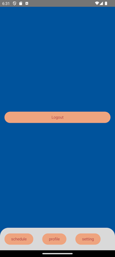

# USERGUIDE
## INTRODUCTION
Thank you for choosing **TutorMe**!

**TutorMe** is your best choice for tutors and students to connect and achieve academic success. Whether you're striving for top grades, aiming to master a challenging subject, or seeking guidance for academic goals, **TutorMe** is here to empower you every step of the way. Through our intuitive interface, students can easily schedule one-on-one sessions with tutors and offer flexible options to work around your busy schedule.

This user guide can assist you in quickly setting up **TutorMe** and how to use the application.
## GETTING STARTED
## INSTALLATION
To download our app, please go to the following link:
https://github.com/macewanCS/w24MacroHard
and download our app.

### Database (Server)
After downloading the app from the GitHub repository, you will need to create a **.env** file.
1. Navigate to the installation destination
2. Navigate to the server directory located in ./w24MacroHard/server
3. Create a .env file in the server directory
4. Copy and paste the following into the .env file and save.
   DB_HOST = "macrohard-onlytutor.cj0646k6g181.us-east-2.rds.amazonaws.com"  
   DB_PORT = 5432  
   DB_USER = "MacroHard"  
   DB_PASSWORD = "chopperiscute"  
   DB_NAME = "postgres"  
   KEY = "codingiscool"

Once the .env file is created you are ready to start the server. The server can be started by opening a terminal in the  ./w24MacroHard/server directory and running the command "**go run main.go**"  
You should see a message that you are successfully connected to the database!

A few notes:
* Go must be installed on your machine for the server to be run
* Directions to install Go can be found here → https://go.dev/doc/install

## USER INTERFACE OVERVIEW
### A - FOR TUTORS
### 1. Landing Page

### 2. Login/Registeration Page
When you first open the app and hit **login** button, you will be transferred to the login/registeration page.

On this page you login to the TutorMe app. If you do not already have an account, please click the bottom text where it says **“Don’t have an Account? Register Here!”**. Otherwise input your email and password into the specified fields along with your student or tutor role in the dropdown box. Once completed, hit the **login** button.

The following page is called **Registeration Page**. Here, you can register an account as a **tutor**.

### 3. Profile Page

On your profile page, it tells you all your registered personal information.   

### 4. Schedule Page
The schedule page will show you all of the appointments you have coming up with your student.When you click on it you will see more details about your appointment and have the ability to edit and cancel your appointments.

**When there is no availability added**

  
When you click on **+Availability**, it will allow you to register your availability.

**Choosing timeslot to add your availability**

### 5. Logout Page
After clicking on setting, you can log out of your account.  

### B - FOR STUDENTS
### 1. Landing Page

### 2. Login/Registeration Page
When you first open the app and hit **login** button, you will be transferred to the login/registeration page.

On this page you login to the TutorMe app. If you do not already have an account, please click the bottom text where it says **“Don’t have an Account? Register Here!”**. Otherwise input your email and password into the specified fields along with your student or tutor role in the dropdown box. Once completed, hit the **login** button.

The following page is called **Registeration Page**. Here, you can register an account as a **student**.

### 3. Profile Page
On your profile page, it tells you all your registered personal information.

### 4. Schedule Page
The schedule page will show you all of the appointments you have coming up with your tutor.When you click on it you will see more details about your appointment and have the ability to edit and cancel your appointments.

**When there is no available session slot to choose**  

**When there are added sessions**

If you need to edit/cancel a session or contact your tutor, click on the target session and you will see the following interface.

### 5. Logout Page
After clicking on setting, you can log out of your account.  

## FEATURE DESCRIPTIONS AND USER MANUAL
## A - FOR TUTORS
### After downloading the app you will need to **create an account**.
1. Press **“Don’t have an account? Register here!”**
2. Choose to register as a **tutor**
3. Fill in all applicable fields and press register.
4. App will automatically take you to the login screen
5. Login to the app with the credentials to your account

Appointments will be given to you as students book their own appointments with you depending on your availability.
### **A1. To add your availability**:
1. Navigate to the session page
2. Press the (**+Availability**) button
3. Choose on the calendar which day you will be available
4. Choose all the applicable time slots of the day that you will be available
5. Repeat steps 3-4 until you have filled in your availability for the month

### **A2. To contact your student:**
1. Navigate to the session page
2. Click on the appointment with the student you want to contact
3. Click on the send email button
4. App will automatically navigate to GMAIL application to send an email to your student

### **A3. To edit a session  with a student:**
1. Navigate to the session page
2. Click on the appointment you wish to edit
3. Click the edit button
4. Change the time or date of the session
5. Confirm the changes
6. Both parties will get an email notification of the change

### **A4. To cancel a session with a student:**
1. Navigate to the session page
2. Click on the appointment you wish to cancel
3. Click the cancel button
4. Confirm the cancellation
5. Both parties will get an email notification of the cancellation

### **A5. To logout of your account:**
1. Navigate to the settings page
2. Press the logout button
3. App will automatically navigate to the login page and your account will be logged out of

## B - FOR STUDENTS
### After downloading the app, you will need to **create an account**.

### **B1. To create an account:**
1. Press **“Don’t have an account? Register here!”**
2. Choose to register as a **student**
3. Fill in all applicable fields and press register.
4. App will automatically take you to the login screen
5. Login to the app with the credentials to your account

### **B2. To create a tutoring appointment with a tutor:**
1. Navigate to the session page
2. Press the (+ Session) button
3. Choose on the calendar which day you will be available
4. Choose all the applicable 1 - 2 hour time slots for your tutoring session
5. App will show you a list of tutors that are available within the specified time slot  
   If no tutors are shown. Go back to step 3-4 and choose another time slot
6. Pick the tutor you want to create an appointment with
7. Session will be shown on your sessions page

### **B3. To contact your tutor:**
1. Navigate to the session page
2. Click on the appointment with the tutor you want to contact
3. Click on the send email button
4. App will automatically navigate to Gmail to send an email to your tutor

### **B4. To edit a session with a tutor:**
1. Navigate to the session page
2. Click on the appointment you wish to edit
3. Click the edit button
4. Change the time or date of the session
5. Confirm the changes
6. Both parties will get an email notification of the change

### **B5. To cancel a session with a tutor:**
1. Navigate to the session page
2. Click on the appointment you wish to cancel
3. Click the cancel button
4. Confirm the cancellation
5. Both parties will get an email notification of the cancellation

### **B6. To logout of your account:**
1. Navigate to the settings page
2. Press the logout button
3. App will automatically navigate to the login page and your account will be logged out of

## REQUESTING A FULL SCHEDULE
For security reason, we only offer a full schedule per request.
1. Send an email to macrohard2024@gmail.com
2. Wait for evaluation of your account
3. If approved, we will send the master schedule, if not then you will be sent an email of refusal.

## BEST PRACTICE AND TIPS
* Only add availability one month in advance for tutors
* Cancel or change appointments more than 24 hours in advance to give ample notice to the tutor/student.
* The app will not allow you to cancel appointments less than 24 hours in advance
* If you notice any bugs or broken features, please contact macrohard2024@gmail.com  

